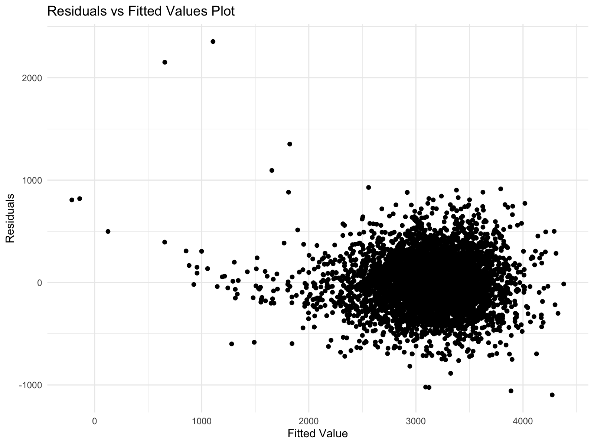
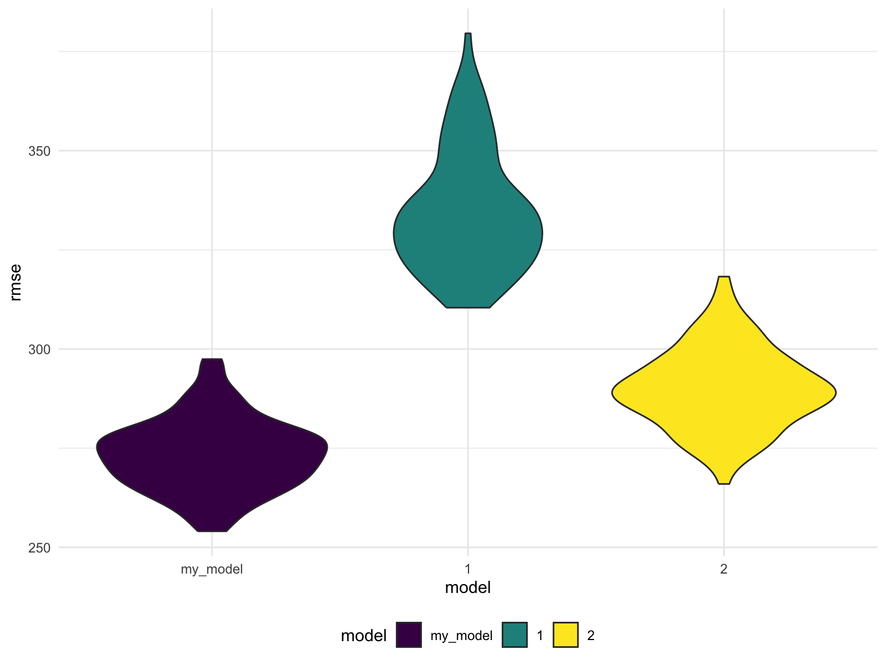

Homework 6
================
Lu Qiu
2023-11-29

### Problem 1

Create a `city_state` variable (e.g. “Baltimore, MD”), and a binary
variable indicating whether the homicide is solved. Omit cities Dallas,
TX; Phoenix, AZ; and Kansas City, MO – these don’t report victim race.
Also omit Tulsa, AL – this is a data entry mistake. For this problem,
limit your analysis those for whom `victim_race` is white or black. Be
sure that `victim_age` is numeric.

``` r
homicide_df = 
  read_csv("data/homicide-data.csv", na = c("", "NA", "Unknown")) |> 
  mutate(
    city_state = str_c(city, state, sep = ", "),
    victim_age = as.numeric(victim_age),
    resolution = case_when(
      disposition == "Closed without arrest" ~ 0,
      disposition == "Open/No arrest"        ~ 0,
      disposition == "Closed by arrest"      ~ 1)
  ) |> 
  filter(victim_race %in% c("White", "Black")) |> 
  filter(!(city_state %in% c("Tulsa, AL", "Dallas, TX", "Phoenix, AZ", "Kansas City, MO"))) |> 
  select(city_state, resolution, victim_age, victim_sex, victim_race)
```

    ## Rows: 52179 Columns: 12
    ## ── Column specification ────────────────────────────────────────────────────────
    ## Delimiter: ","
    ## chr (8): uid, victim_last, victim_first, victim_race, victim_sex, city, stat...
    ## dbl (4): reported_date, victim_age, lat, lon
    ## 
    ## ℹ Use `spec()` to retrieve the full column specification for this data.
    ## ℹ Specify the column types or set `show_col_types = FALSE` to quiet this message.

For the city of Baltimore, MD, use the glm function to fit a logistic
regression with resolved vs unresolved as the outcome and victim age,
sex and race as predictors. Save the output of glm as an R object; apply
the broom::tidy to this object; and obtain the estimate and confidence
interval of the adjusted odds ratio for solving homicides comparing male
victims to female victims keeping all other variables fixed.

``` r
baltimore_glm = 
  filter(homicide_df, city_state == "Baltimore, MD") |> 
  glm(resolution ~ victim_age + victim_sex + victim_race, family = binomial(), data = _)

baltimore_glm |> 
  broom::tidy() |> 
  mutate(
    OR = exp(estimate), 
    OR_CI_upper = exp(estimate + 1.96 * std.error),
    OR_CI_lower = exp(estimate - 1.96 * std.error)) |> 
  filter(term == "victim_sexMale") |> 
  select(OR, OR_CI_lower, OR_CI_upper) |>
  knitr::kable(digits = 3)
```

|    OR | OR_CI_lower | OR_CI_upper |
|------:|------------:|------------:|
| 0.426 |       0.325 |       0.558 |

Now run glm for each of the cities in your dataset, and extract the
adjusted odds ratio (and CI) for solving homicides comparing male
victims to female victims. Do this within a “tidy” pipeline, making use
of purrr::map, list columns, and unnest as necessary to create a
dataframe with estimated ORs and CIs for each city.

``` r
model_results = 
  homicide_df |> 
  nest(data = -city_state) |> 
  mutate(
    models = map(data, \(df) glm(resolution ~ victim_age + victim_sex + victim_race, 
                             family = binomial(), data = df)),
    tidy_models = map(models, broom::tidy)) |> 
  select(-models, -data) |> 
  unnest(cols = tidy_models) |> 
  mutate(
    OR = exp(estimate), 
    OR_CI_upper = exp(estimate + 1.96 * std.error),
    OR_CI_lower = exp(estimate - 1.96 * std.error)) |> 
  filter(term == "victim_sexMale") |> 
  select(city_state, OR, OR_CI_lower, OR_CI_upper)

model_results |>
  slice(1:5) |> 
  knitr::kable(digits = 3)
```

| city_state      |    OR | OR_CI_lower | OR_CI_upper |
|:----------------|------:|------------:|------------:|
| Albuquerque, NM | 1.767 |       0.831 |       3.761 |
| Atlanta, GA     | 1.000 |       0.684 |       1.463 |
| Baltimore, MD   | 0.426 |       0.325 |       0.558 |
| Baton Rouge, LA | 0.381 |       0.209 |       0.695 |
| Birmingham, AL  | 0.870 |       0.574 |       1.318 |

Create a plot that shows the estimated ORs and CIs for each city.
Organize cities according to estimated OR, and comment on the plot.

``` r
model_results |> 
  mutate(city_state = fct_reorder(city_state, OR)) |> 
  ggplot(aes(x = city_state, y = OR)) + 
  geom_point() + 
  geom_errorbar(aes(ymin = OR_CI_lower, ymax = OR_CI_upper)) + 
  theme(axis.text.x = element_text(angle = 90, hjust = 1))
```


From this plot we see that most cities have odds ratios that are smaller
than 1, suggesting that crimes with male victims have smaller odds of
resolution compared to crimes with female victims after adjusting for
victim age and race. This disparity is strongest in New York. In roughly
half of these cities, confidence intervals are narrow and do not contain
1, suggesting a significant difference in resolution rates by sex after
adjustment for victim age and race.

### Problem 2

#### Load the data

For this problem, we’ll use the Central Park weather data similar to
data we’ve seen elsewhere. The code chunk below will download these
data.

``` r
weather_df = 
  rnoaa::meteo_pull_monitors(
    c("USW00094728"),
    var = c("PRCP", "TMIN", "TMAX"), 
    date_min = "2022-01-01",
    date_max = "2022-12-31") |>
  mutate(
    name = recode(id, USW00094728 = "CentralPark_NY"),
    tmin = tmin / 10,
    tmax = tmax / 10) |>
  select(name, id, everything())
```

    ## using cached file: /Users/luqiu/Library/Caches/org.R-project.R/R/rnoaa/noaa_ghcnd/USW00094728.dly

    ## date created (size, mb): 2023-10-31 11:07:27.571927 (8.538)

    ## file min/max dates: 1869-01-01 / 2023-10-31

``` r
set.seed(1)
```

#### Bootstrapping

The bootstrap is helpful when you’d like to perform inference for a
parameter / value / summary that doesn’t have an easy-to-write-down
distribution in the usual repeated sampling framework. We’ll focus on a
simple linear regression with tmax as the response with tmin and prcp as
the predictors, and are interested in the distribution of two quantities
estimated from these data:

- $r^2$
- log(β̂ 1∗β̂ 2)

Use 5000 bootstrap samples and, for each bootstrap sample, produce
estimates of these two quantities. Plot the distribution of your
estimates, and describe these in words. Using the 5000 bootstrap
estimates, identify the 2.5% and 97.5% quantiles to provide a 95%
confidence interval for r̂ 2 and log(β̂ 0∗β̂ 1) . Note: broom::glance() is
helpful for extracting r̂ 2 from a fitted regression, and broom::tidy()
(with some additional wrangling) should help in computing log(β̂ 1∗β̂ 2) .

First, generate bootstrap samples.

``` r
boot_sample = function(df){
  
  sample_frac(df, replace = TRUE)
}

boot_straps =
  tibble(strap_number = 1:5000) |>
  mutate(
    strap_sample = map(strap_number, \(i) boot_sample(weather_df))
  )
```

#### Fit the linear model

Next, fit the linear model with tmax as the response and tmin and prcp
as predictors.

``` r
boot_results =
  boot_straps |>
  mutate(
    models = map(strap_sample, \(df) lm(tmax ~ tmin + prcp, data = df)),
    r_squared = map(models, ~ broom::glance(.)$r.squared),
    beta_product = map(models, ~ log(broom::tidy(.)$estimate[2] * broom::tidy(.)$estimate[3]))
  ) |>
  select(strap_number, r_squared, beta_product) |>
  mutate(beta_product = unlist(beta_product),
         r_squared = unlist(r_squared))
```

#### Plot the distribution

Plot the distribution of estimates.

``` r
# Plotting distribution of r_squared
boot_results |>
  ggplot(aes(x = r_squared)) + 
  geom_density() +
  labs(title = "Distribution of R-squared Estimates")
```


``` r
# Plotting distribution of log(beta1 * beta2)
boot_results |>
  ggplot(aes(x = beta_product)) +
  geom_density() +
  labs(title = "Distribution of log(beta1 * beta2) Estimates")
```


The r-squared value is high and appears to follow a normal distribution,
centered around ~0.92. However, the distribution of log(beta1 \* beta2)
is somewhat left-skewed.

#### Calculate 95% CI

Calculate the 95% confidence intervals

``` r
# CI for r_square
boot_results |>
  summarize(
    ci_lower = quantile(r_squared, 0.025),
    ci_upper = quantile(r_squared, 0.975)) |>
  knitr::kable(digits = 3)
```

| ci_lower | ci_upper |
|---------:|---------:|
|    0.889 |    0.941 |

``` r
# CI for beta_product
boot_results |>
  filter(!is.nan(beta_product)) |>
  summarize(
    ci_lower = quantile(r_squared, 0.025),
    ci_upper = quantile(r_squared, 0.975)) |>
  knitr::kable(digits = 3)
```

| ci_lower | ci_upper |
|---------:|---------:|
|     0.88 |    0.927 |

### Problem 3

#### Load and clean data

Load and clean the data for regression analysis (i.e. convert numeric to
factor where appropriate, check for missing data, etc.).

``` r
birthweight_df = 
  read_csv("data/birthweight.csv", na = c("", "NA", "Unknown")) |>
  janitor::clean_names() |>
  mutate(babysex = as.factor(babysex),
         frace = as.factor(frace),
         malform = as.factor(malform),
         mrace = as.factor(mrace)) |>
  select(bwt,everything())
```

    ## Rows: 4342 Columns: 20
    ## ── Column specification ────────────────────────────────────────────────────────
    ## Delimiter: ","
    ## dbl (20): babysex, bhead, blength, bwt, delwt, fincome, frace, gaweeks, malf...
    ## 
    ## ℹ Use `spec()` to retrieve the full column specification for this data.
    ## ℹ Specify the column types or set `show_col_types = FALSE` to quiet this message.

``` r
# check for missing values
sum(is.na(birthweight_df))
```

    ## [1] 0

#### Fit a full model

First, we fit a linear model with all the other variables as predictors.

``` r
fit = lm(bwt ~., data = birthweight_df) 
broom::tidy(fit) |> knitr::kable()
```

| term        |      estimate |   std.error |  statistic |   p.value |
|:------------|--------------:|------------:|-----------:|----------:|
| (Intercept) | -6265.3914076 | 660.4010631 | -9.4872522 | 0.0000000 |
| babysex2    |    28.7073088 |   8.4652447 |  3.3911966 | 0.0007021 |
| bhead       |   130.7781455 |   3.4523248 | 37.8811826 | 0.0000000 |
| blength     |    74.9535780 |   2.0216656 | 37.0751613 | 0.0000000 |
| delwt       |     4.1007326 |   0.3948202 | 10.3863301 | 0.0000000 |
| fincome     |     0.2898207 |   0.1795416 |  1.6142265 | 0.1065513 |
| frace2      |    14.3312853 |  46.1501283 |  0.3105362 | 0.7561682 |
| frace3      |    21.2361118 |  69.2959907 |  0.3064551 | 0.7592729 |
| frace4      |   -46.9962310 |  44.6782159 | -1.0518824 | 0.2929123 |
| frace8      |     4.2969242 |  74.0740827 |  0.0580085 | 0.9537446 |
| gaweeks     |    11.5493872 |   1.4653680 |  7.8815609 | 0.0000000 |
| malform1    |     9.7649680 |  70.6258929 |  0.1382633 | 0.8900388 |
| menarche    |    -3.5507723 |   2.8950777 | -1.2264860 | 0.2200827 |
| mheight     |     9.7874130 |  10.3115672 |  0.9491683 | 0.3425881 |
| momage      |     0.7593479 |   1.2221417 |  0.6213256 | 0.5344182 |
| mrace2      |  -151.4354038 |  46.0453432 | -3.2888321 | 0.0010141 |
| mrace3      |   -91.3866079 |  71.9189677 | -1.2706885 | 0.2039079 |
| mrace4      |   -56.4787268 |  45.1368828 | -1.2512766 | 0.2109013 |
| parity      |    95.5411137 |  40.4792711 |  2.3602479 | 0.0183069 |
| pnumlbw     |            NA |          NA |         NA |        NA |
| pnumsga     |            NA |          NA |         NA |        NA |
| ppbmi       |     4.3537865 |  14.8913292 |  0.2923706 | 0.7700173 |
| ppwt        |    -3.4715550 |   2.6121254 | -1.3290155 | 0.1839131 |
| smoken      |    -4.8543629 |   0.5870549 | -8.2690107 | 0.0000000 |
| wtgain      |            NA |          NA |         NA |        NA |

#### Select variables

Then, we select predictors from the full model using a stepwise
approach.

``` r
stepwise_model <- MASS::stepAIC(fit, direction = "both", trace = FALSE)
broom::tidy(stepwise_model) |> knitr::kable()
```

| term        |      estimate |   std.error |  statistic |   p.value |
|:------------|--------------:|------------:|-----------:|----------:|
| (Intercept) | -6098.8219113 | 137.5463421 | -44.340124 | 0.0000000 |
| babysex2    |    28.5580171 |   8.4548958 |   3.377690 | 0.0007374 |
| bhead       |   130.7770408 |   3.4465672 |  37.944144 | 0.0000000 |
| blength     |    74.9471109 |   2.0190479 |  37.120027 | 0.0000000 |
| delwt       |     4.1067316 |   0.3920592 |  10.474775 | 0.0000000 |
| fincome     |     0.3180229 |   0.1747477 |   1.819898 | 0.0688436 |
| gaweeks     |    11.5924873 |   1.4620657 |   7.928842 | 0.0000000 |
| mheight     |     6.5940377 |   1.7848817 |   3.694383 | 0.0002231 |
| mrace2      |  -138.7924801 |   9.9070869 | -14.009414 | 0.0000000 |
| mrace3      |   -74.8867755 |  42.3146313 |  -1.769761 | 0.0768374 |
| mrace4      |  -100.6781427 |  19.3246910 |  -5.209819 | 0.0000002 |
| parity      |    96.3046933 |  40.3362158 |   2.387549 | 0.0170038 |
| ppwt        |    -2.6755853 |   0.4273585 |  -6.260752 | 0.0000000 |
| smoken      |    -4.8434197 |   0.5855757 |  -8.271210 | 0.0000000 |

The selected predictors are: babysex, bhead, blength, delwt, fincome,
gaweeks, mheight, mrace, parity, ppwt, smoken.

#### Residuals vs fitted values plot

``` r
birthweight_df |>
  add_predictions(stepwise_model) |>
  add_residuals(stepwise_model) |>
  ggplot(aes(x = pred, y = resid)) + 
  geom_point() +
  labs(title = "Residuals vs Fitted Values Plot") + 
  xlab("Fitted Value") + 
  ylab("Residuals")
```



#### Model comparison

Compare my model to two others:

- One using length at birth and gestational age as predictors (main
  effects only)
- One using head circumference, length, sex, and all interactions
  (including the three-way interaction) between these

``` r
cv_df =
  crossv_mc(birthweight_df, 100) |>
  mutate(
    train = map(train, as_tibble),
    test = map(test, as_tibble))
```

``` r
cv_df |>
  mutate(
    my_model  = map(train, ~lm(bwt ~ babysex + bhead + blength + delwt + fincome + 
    gaweeks + mheight + mrace + parity + ppwt + smoken, data = .x)),
    model_1  = map(train, ~lm(bwt ~ gaweeks + blength, data = .x)),
    model_2  = map(train, ~lm(bwt ~ bhead*blength*babysex, data = .x))) |>
  mutate(
    rmse_my_model = map2_dbl(my_model, test, ~rmse(model = .x, data = .y)),
    rmse_1    = map2_dbl(model_1, test, ~rmse(model = .x, data = .y)),
    rmse_2 = map2_dbl(model_2, test, ~rmse(model = .x, data = .y))) |>
  summarize(
    avg_rmse_my_model = mean(rmse_my_model),
    avg_rmse_model_1 = mean(rmse_1),
    avg_rmse_model_2  = mean(rmse_2)
  ) |>
  knitr::kable()
```

| avg_rmse_my_model | avg_rmse_model_1 | avg_rmse_model_2 |
|------------------:|-----------------:|-----------------:|
|          273.3941 |         334.6094 |         290.0545 |

The plot below shows the distribution of RMSE values for each candidate
model.

``` r
cv_df |>
  mutate(
    my_model  = map(train, ~lm(bwt ~ babysex + bhead + blength + delwt + fincome + 
    gaweeks + mheight + mrace + parity + ppwt + smoken, data = .x)),
    model_1  = map(train, ~lm(bwt ~ gaweeks + blength, data = .x)),
    model_2  = map(train, ~lm(bwt ~ bhead*blength*babysex, data = .x))) |>
  mutate(
    rmse_my_model = map2_dbl(my_model, test, ~rmse(model = .x, data = .y)),
    rmse_1    = map2_dbl(model_1, test, ~rmse(model = .x, data = .y)),
    rmse_2 = map2_dbl(model_2, test, ~rmse(model = .x, data = .y))) |>
  select(starts_with("rmse")) |>
  pivot_longer(
    everything(),
    names_to = "model", 
    values_to = "rmse",
    names_prefix = "rmse_") |> 
  mutate(model = fct_inorder(model)) |> 
  ggplot(aes(x = model, y = rmse)) + 
  geom_violin(aes(fill = model))
```



From the above plot, we can see that my model has the lowest mean RMSE,
indicating the best model performance among the three models. The main
effect model (model 1) has the highest RMSE. The interaction model
(model 2) has RMSE slightly higher than my model.
